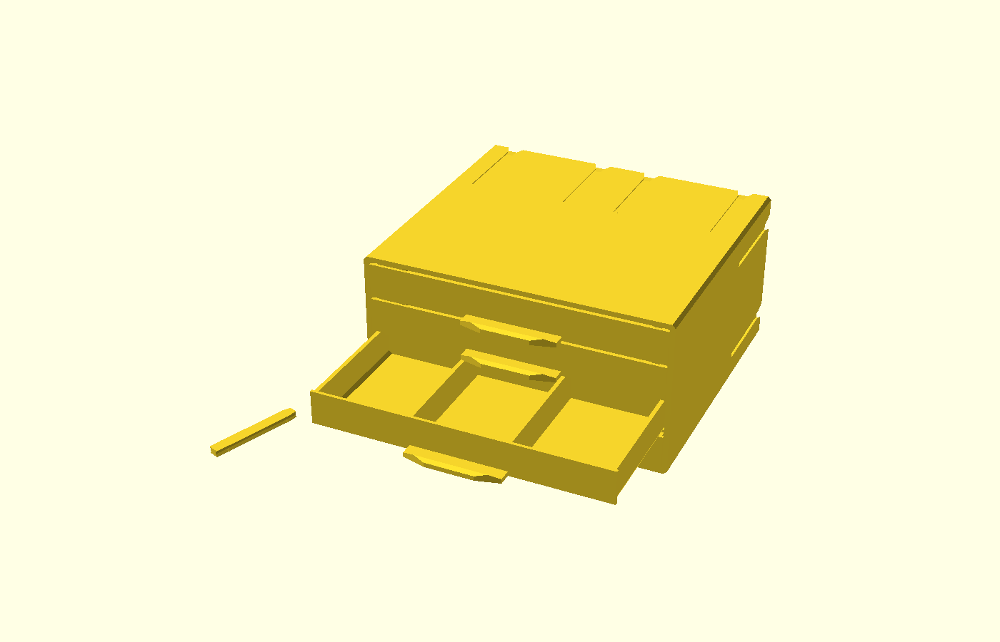
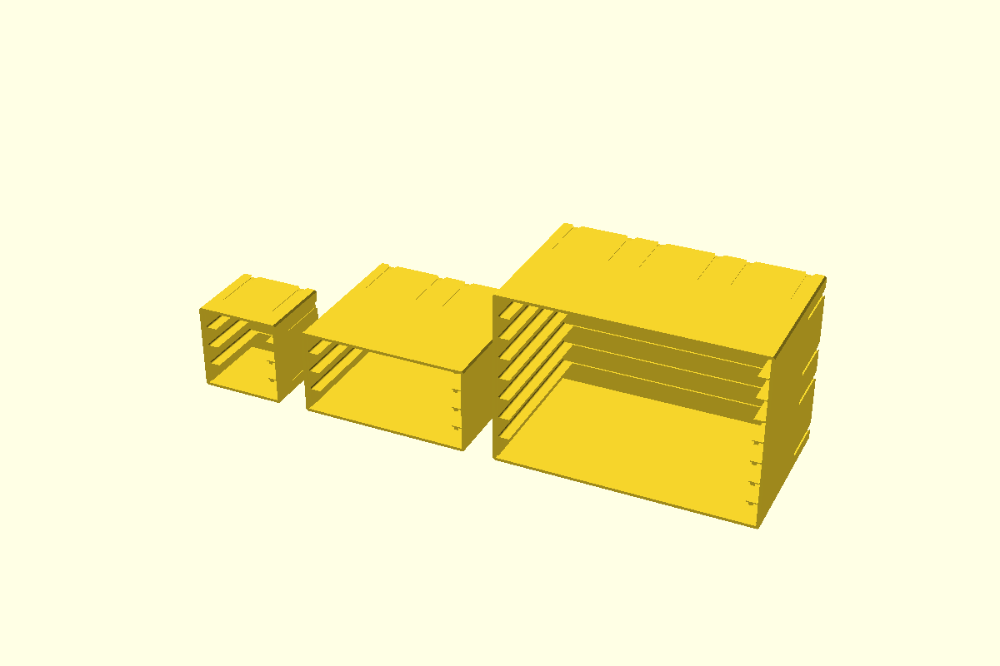
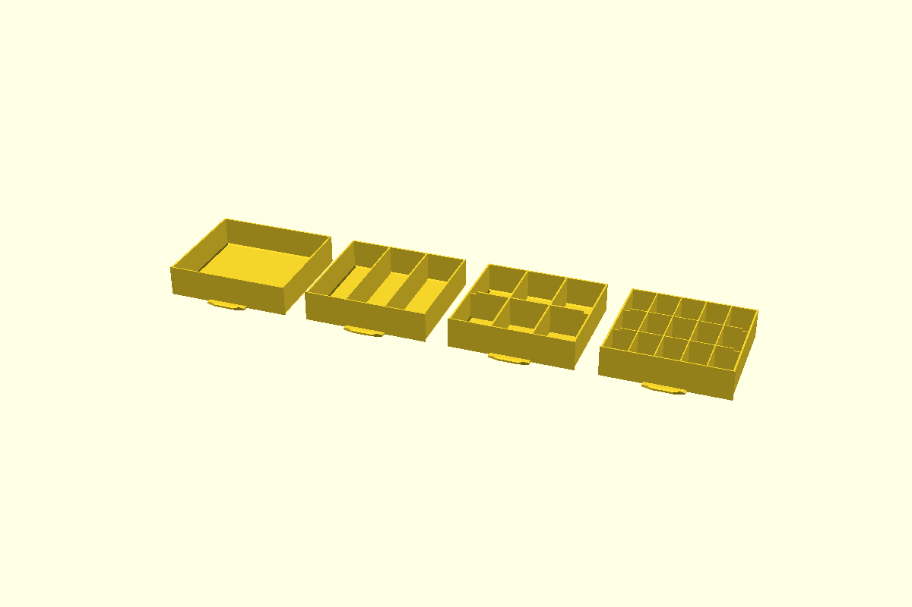
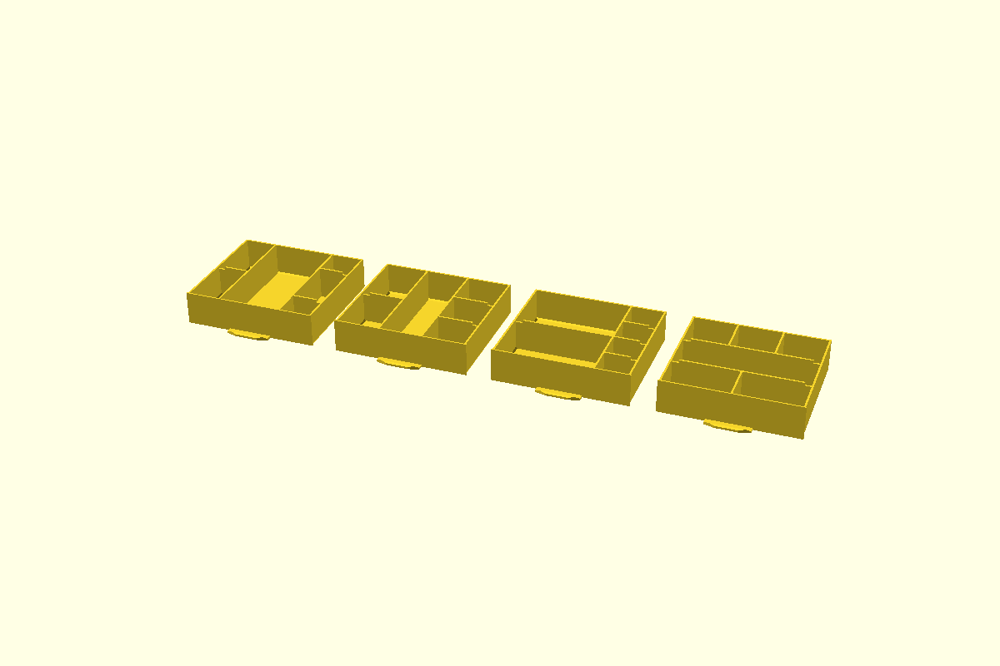
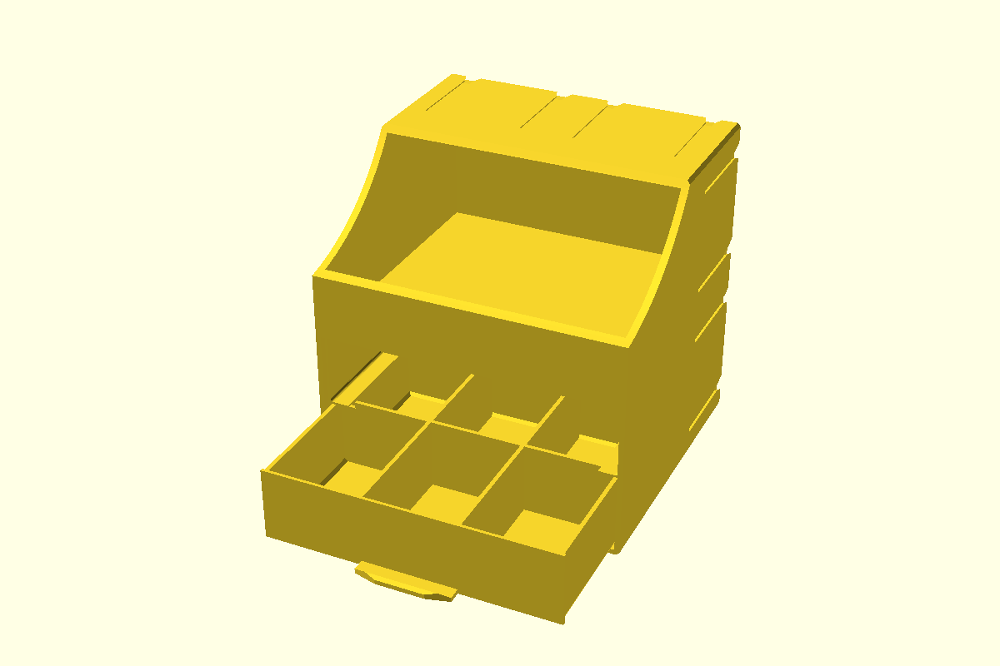
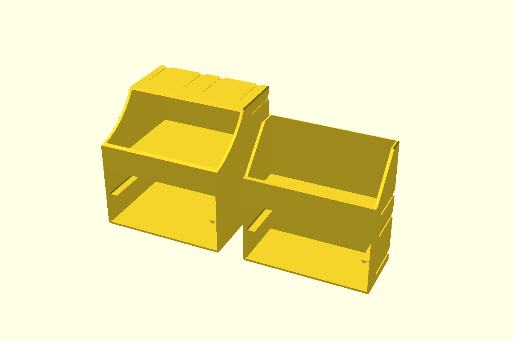
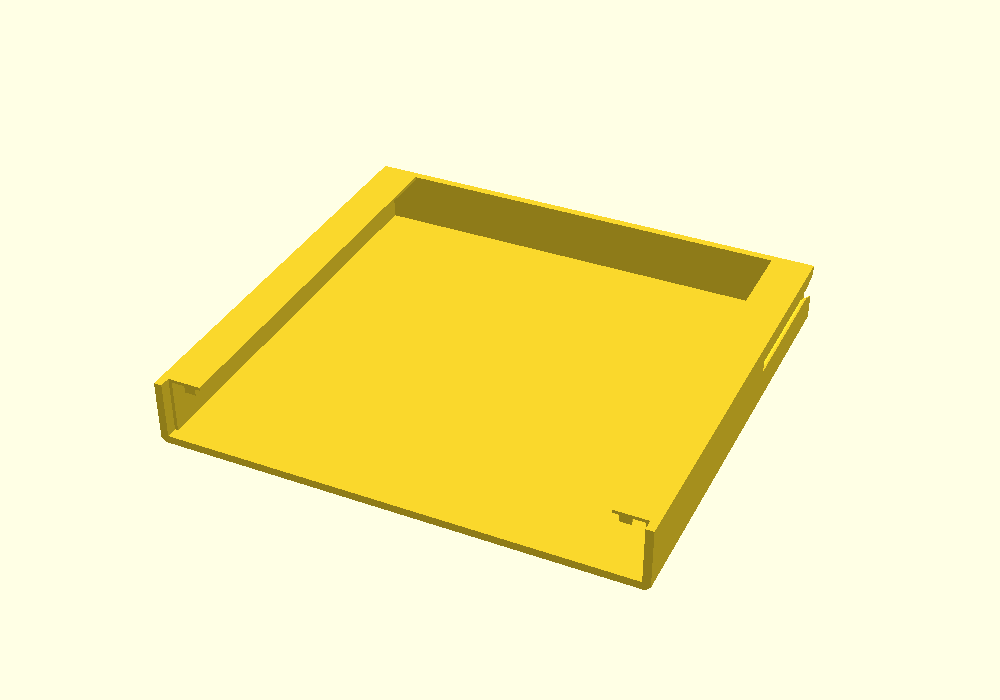
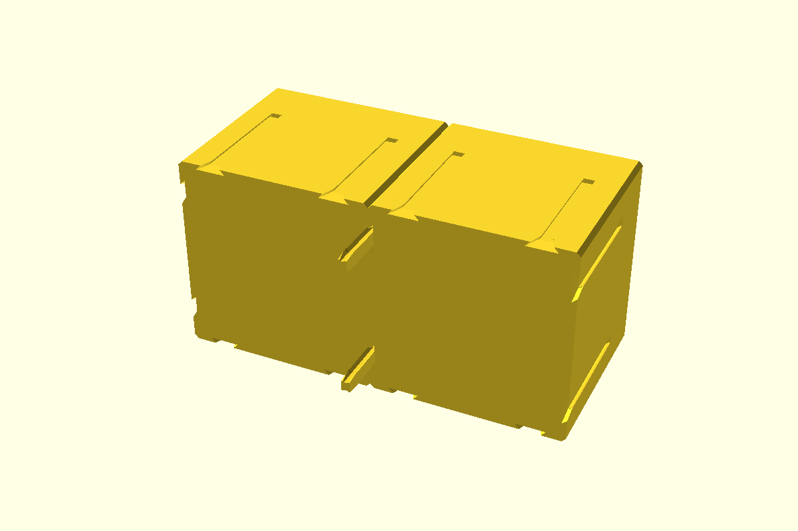
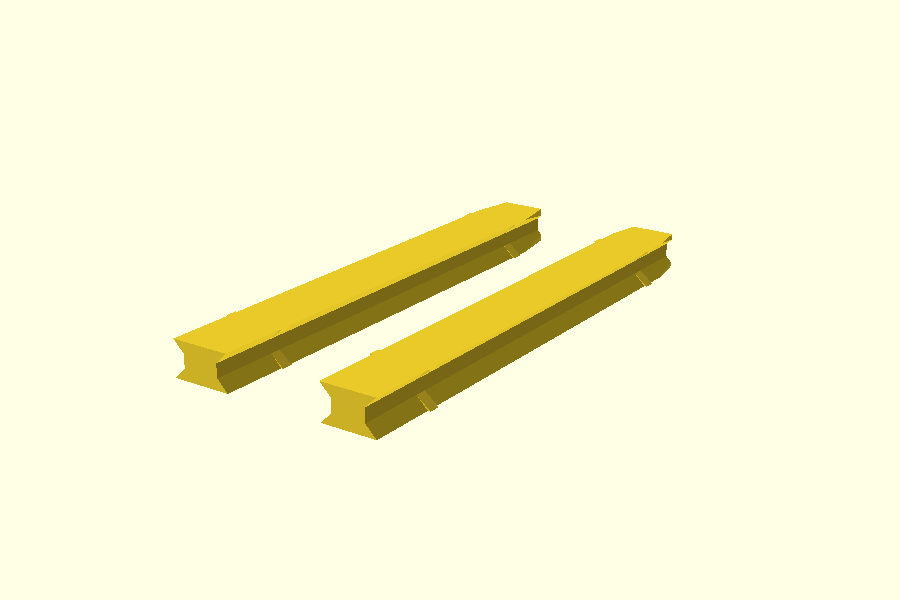
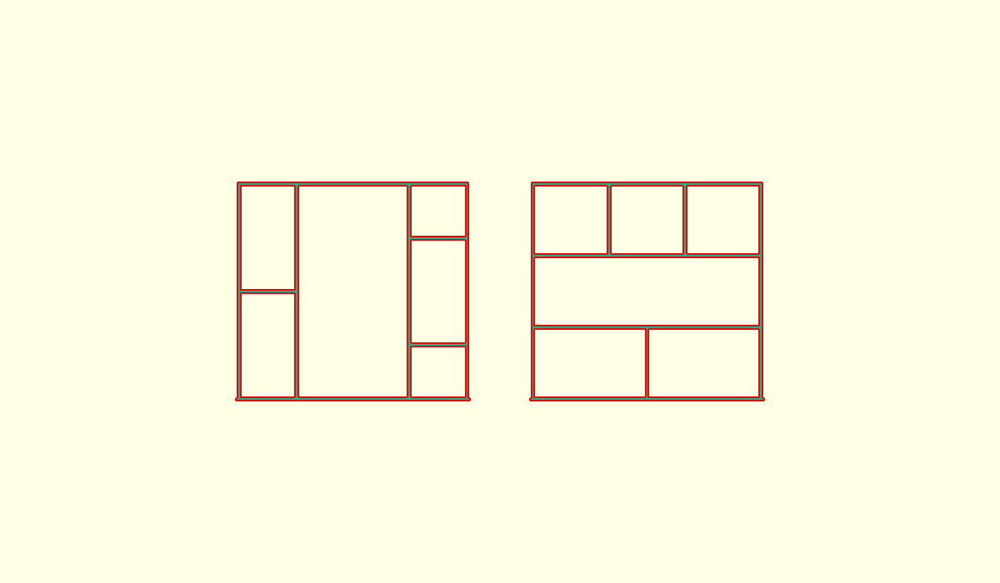

# Parametric Stackable Organizer

Stackable drawer boxes for a workshop, generated to any size you need.
Resistors, screws, connectors, beads — whatever comes in small quantities and
has to stay sorted. Build a box, a drawer, an open bin or a connector clip on
the grid, and the parts stay **dimensionally compatible with the original
printed models**, so new pieces clip onto boxes you already have.



---

## Credits and licence

This is a derivative work. The original design is not mine:

- **Various Size Stackable Resistor Storage Box** by **termlimit** —
  https://www.thingiverse.com/thing:3873672
- based on the original storage box by **STTrife**

Licence: **Creative Commons — Attribution — NonCommercial (CC BY-NC)**,
inherited from the original. Attribution to termlimit and STTrife is required,
and **commercial use is not permitted**.

> **Before uploading anywhere:** several model platforms run paid or
> points-based reward programmes. Publishing a CC BY-NC derivative into such a
> programme may conflict with the NonCommercial term. Check the platform's
> rules and the original licence before you monetise anything here.

---

## Gallery

| | |
|---|---|
|  **Boxes** — 1×1×1, 2×2×1 and 3×2×2 |  **Drawers** — 1, 3, 6 and 15 compartments |
|  **Mixed compartments** — a different split per column |  **Drawers plus an open bin** |
|  **Deep bin with a roof vs. shallow open shelf** |  **Inside a slot** — rails and the anti-fallout catches |
|  **Two boxes joined** with connector clips | |



---

## Quick start

1. Install [OpenSCAD](https://openscad.org/) (2021.01 or newer).
2. Open **`presets.scad`** — this is the only file you need to touch.
3. `Window → Customizer`, pick a part and a size.
4. **F5** preview · **F6** render · **F7** export STL.

From the command line:

```sh
openscad -D 'part="drawer"' -D width_units=3 -D depth_units=2 \
         -D drawer_height_mm=34.66 -D compartments_across=5 \
         -D compartments_deep=3 -D divider_thickness=1.20 \
         -o my_drawer.stl presets.scad
```

Ready-made examples are in **`stl/`** — rebuild them any time with
`sh tools/build_examples.sh`.

---

## Parameters

Everything is set in `presets.scad`.

### What to generate

| Parameter | Meaning |
|---|---|
| `part` | `demo`, `box`, `box_bin`, `drawer`, `connector`, `connector_tolerant` |

### Size

| Parameter | Meaning |
|---|---|
| `width_units` | Width in grid units of **73.06 mm** (1, 2, 2.5, 3) |
| `depth_units` | Depth in grid units of **67.20 mm** (1, 2) |
| `height_units` | Height in grid units of **74.64 mm** (boxes only) |

### Drawer slots

| Parameter | Meaning |
|---|---|
| `drawer_slots` | How many drawer slots the box has **in total**. The drawer height follows automatically. |
| `drawer_height_mm` | Override the drawer height. Leave `0` to derive it from the slot count. |

For a box one unit tall:

| Slots | Slot clearance | Matching drawer |
|---|---|---|
| 4 | 16.50 mm | **16.20 mm** |
| 2 | 33.96 mm | 33.66 mm |
| 1 | 68.88 mm | 68.58 mm |

### Drawer

| Parameter | Meaning |
|---|---|
| `compartments_across` | Compartments across the width |
| `compartments_deep` | Compartments front to back |
| `divider_thickness` | Divider thickness. Originals use 1.92 on 2-unit models, 1.20 on 3-unit ones. |
| `handle` | Pull handle under the front |

#### Compartments that are not a plain grid

`compartments_across` × `compartments_deep` gives equal compartments. For
anything else, set **`drawer_layout`** in `presets.scad` (it sits below the
Customizer settings, because the Customizer cannot show a list of lists).

One entry per column, front to back, written as `[width weight, [row weights]]`:

```scad
drawer_layout = [ [1, [1,1]],       // 2 equal rows
                  [2, [1]],         // twice as wide, undivided
                  [1, [1,2,1]] ];   // 3 rows, the middle one twice as deep
```


*Three columns split differently, the `[2,1,3]` shorthand, a wide half beside a
narrow one, and — on the right — the same idea turned through 90°.*

The weights are relative and always fill the drawer, so `[1,2,1]` and
`[10,20,10]` describe the same drawer and you never work in millimetres. A
plain number is shorthand for a standard-width column with that many equal
rows:

```scad
drawer_layout = [2, 1, 3];                       // columns of 2, 1 and 3 rows
drawer_layout = [ [3, [1,1]], [1, [1,1,1,1]] ];  // wide half in 2, narrow in 4
```

Cross dividers belong to their column, so each one is only as wide as that
column. `drawer_layout` overrides `compartments_across` and
`compartments_deep`; leave it `[]` to use those instead.

The same list can be read the other way round, with **`drawer_layout_dir`**:

| Value | Meaning |
|---|---|
| `"cols"` | Columns, each with its own rows (the default) |
| `"rows"` | Bands across the drawer, each with its own columns. The first weight is then the depth of the band. |

```scad
drawer_layout     = [ [1,[1,1]], [1,[1]], [1,[1,1,1]] ];
drawer_layout_dir = "rows";   // 3 bands: 2 columns, then none, then 3
```

The fourth drawer in the picture above is that one. Whichever way you read it,
the dividers that cross the drawer are notched for the catches and those
running front to back are not — so the drawer still closes.



*The same two layouts seen from above, cut just above the floor: on the left
`[[1,[1,1]], [2,[1]], [1,[1,2,1]]]` read as columns, on the right
`[[1,[1,1]], [1,[1]], [1,[1,1,1]]]` read as bands. The drawer front — the
handle end — is at the bottom.*

### Connector slots

| Parameter | Meaning |
|---|---|
| `slots_on_every_unit` | Slots on every grid unit, so any box clips anywhere. Off = only along the outer edges. |
| `slot_length_mm` | Slot length. Leave `0` for the standard 46.80 mm from the back face. |

### Open bin

| Parameter | Meaning |
|---|---|
| `bin_height` | Bin height in mm, from its floor to the top of the box. `0` = half the box. |
| `bin_drawer_slots` | Drawer slots below the bin. `0` = bin only. |
| `bin_lip_height` | Front lip that holds the contents in. Trimmed automatically if it would not fit. |
| `bin_front_flush` | Front panel flush with the face. Off = recessed behind the front frame. |
| `bin_roof` | Roof over the back of the bin. `auto` drops it when the box is too shallow for it to be useful. |

The bin adjusts itself when a setting does not fit — a shelf that would land on
the top face is moved down, an over-tall lip is trimmed, and slots that a clip
could no longer reach are dropped. Every adjustment is reported in the console,
so nothing changes silently.

---

## Printing

Test-printed: drawers in boxes of the original design, and a 2×2×2 box with
five slots plus its drawers. Still, check the fit on your first part before
printing a whole set.

| | |
|---|---|
| Orientation, boxes | Open front **facing up**. The drawer rails then print as vertical walls instead of overhangs. |
| Orientation, drawers | As generated, open side up. |
| Orientation, clips | Flat on the bed. |
| Supports | None needed in those orientations. The outer bottom and top edges are chamfered 1.5 mm for exactly this reason. |
| Layer height | 0.2 mm is a good default. The finest features (0.96 mm rail plates, 1.20 mm dividers) print fine at that. |
| Material | PLA or PETG. |

**Fit is tight by design.** Drawers have 0.35 mm clearance per side, and so do
the clips in their slots. If your printer runs wide, print
`connector_loose.stl` (0.15 mm narrower per side) instead of `connector.stl`.

The anti-fallout catches under each rail are **meant** to interfere: a drawer
is 15.80 mm tall in a 16.50 mm slot, and the catch hangs 2.30 mm into it. Tilt
the drawer to insert or remove it; in normal use it cannot be pulled out far
enough to fall.

In every slot above the lowest one the drawer rests on the small fillet where
the rail meets the side wall, about 0.2 mm higher than the slot floor. That is
expected and leaves about 0.1 mm above the drawer front. If drawers in the
upper slots feel tight, raise `DRAWER_CLEARANCE_H` in `params.scad`
(0.30 → 0.50): it makes the drawers lower without changing the boxes.

---

## Repository layout

| Path | What it is |
|---|---|
| `presets.scad` | **Open this.** All the settings live here. |
| `organizer.scad` | The modules: `box()`, `drawer()`, `connector()`, `box_drawer_bin()` |
| `params.scad` | Every dimension, in one place |
| `stl/` | Ready-to-print examples |
| `images/` | Gallery renders — rebuild with `tools/render_gallery.sh` |
| `tools/build_examples.sh` | Rebuilds `stl/` |
| `tools/render_gallery.sh` | Rebuilds `images/` |
| `tools/check_presets.sh` | Builds every part, fails on errors, warnings or empty output |
| `presets.json` | Customizer parameter sets |

Anything you export yourself (`.stl`, `.3mf`, `.pdf`) lands in the top folder
and is git-ignored, so your own prints never end up in a commit.

---

## Compatibility

Parts built here share the grid and the interlocking geometry of the system, so
they fit boxes you have already printed:

| | |
|---|---|
| Grid unit | 73.06 × 67.20 × 74.64 mm |
| Drawer clearance | 0.35 mm per side |
| Connector slot | 1.60 mm deep, 4.00 mm at the mouth, 6.00 mm at the bottom, 45° undercut |
| Slot length | 46.80 mm from the back face |
| Clip | 44.80 mm long, 3.20 mm thick — one clip fills the slots of two boxes |
| Divider notches | 7.00 mm in from each side wall, 3.00 mm deep |

That last one matters: the box has anti-fallout catches hanging below every
rail, and they reach inboard past the drawer's inner wall face. A divider
running full height across the drawer would hit them, so **cross dividers are
notched along both side walls** to let the catches pass. Without the notch a
drawer with cross dividers simply will not close.

Dividers running front to back keep their full height — they run parallel to
the catches. The one exception is a divider that lands in a catch's path,
which happens only with very many compartments across; it is notched as well,
and the console says so.

## Limitations

- **One-unit-wide drawers** are not built. That size needs an overlay front,
  wider than the box, which this library does not do.
- **Drawers one unit deep** need `drawer_height_mm` set explicitly.
- The box edges are chamfered 1.5 mm top and bottom for support-free printing.
  Set `EDGE_CHAMFER = 0` in `params.scad` if you want square edges.
